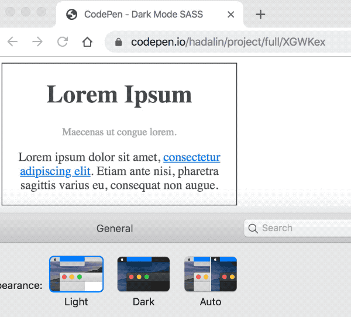

# dark-mode-sass

SCSS file to support dark mode on your webpage (e.g. Jekyll blog).



## Features

- Generates color variables you define in `colors.scss` which can then be assigned to properties
- Provides fallback for browsers that don't support CSS custom variables.

## Instructions

- Copy/paste [colors.scss](colors.scss) into your project
- Tweak `$colors` in `colors.scss` to your liking
- Import it to your Sass/SCSS file
- Assign a color to a property using `color-assign`

## Example

```scss
@import 'colors';

body {
  @include color-assign(background-color, background);
  @include color-assign(color, primary-500);

  a {
    @include color-assign(color, accent-500);

    &:hover {
      @include color-assign(color, accent-600);
    }
  }

  div {
      @include color-assign(border, primary-600, '1px solid here');
  }
}
```

produces

```css
:root {
  --color-background: #fff;
  --color-primary-400: #acacac;
  --color-primary-500: #505050;
  --color-primary-600: #3c3c3c;
  --color-accent-500: #007bff;
  --color-accent-600: #0056b3;
}

@media (prefers-color-scheme: dark) {
  :root {
    --color-background: #222;
    --color-primary-400: #757575;
    --color-primary-500: #ccc;
    --color-primary-600: #e6e6e6;
    --color-accent-500: #1e8ad6;
    --color-accent-600: #3ba0e6;
  }
}

body {
  background-color: #fff;
  background-color: var(--color-background);
  color: #505050;
  color: var(--color-primary-500);
}

body a {
  color: #007bff;
  color: var(--color-accent-500);
}

body a:hover {
  color: #0056b3;
  color: var(--color-accent-600);
}

body div {
  border: 1px solid #3c3c3c;
  border: 1px solid var(--color-primary-600);
}

```

## Live Demo

- https://codepen.io/hadalin/project/editor/XGWKex
